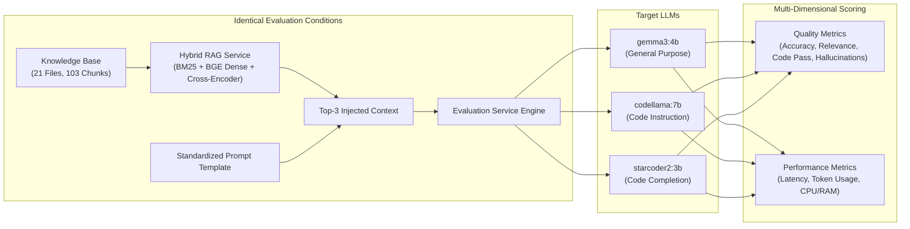
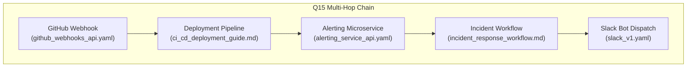

# Lab 4: LLM Model Benchmarking, Quantitative Evaluation & RAG Pipeline Analysis

---

## Executive Summary

This report documents the systematic evaluation of the **Archon Enterprise API Copilot** stack across **3 local LLMs** (`gemma3:4b`, `codellama:7b`, `starcoder2:3b`) using a standardized **26-question benchmark dataset** under identical RAG and hardware conditions. A total of **78 evaluation pairs** were executed, scored, and analyzed.



---

## Exercise 1: Evaluate Multiple LLM Models

### 1.1 Evaluated Models

Three distinct open-weights models were benchmarked:

1. **`gemma3:4b`** (Google, 4.3B parameters, Q4_K_M) — General-purpose multimodal / instruction model.
2. **`codellama:7b`** (Meta, 7B parameters, Q4_0) — Code-specialized instruction model.
3. **`starcoder2:3b`** (BigCode, 3B parameters, Q4_0) — Code-completion / fill-in-the-middle model.

### 1.2 Experimental Controls & Standardization

To isolate the effect of model architecture and training objective on application performance, the following variables were strictly held constant across all 78 evaluations:

- **Application Stack:** Archon API Copilot microservices (`rag-service`, `ingestion-service`, `evaluation-service`).
- **Prompt Template:** Byte-for-byte identical prompt dispatched to Ollama (`stream=False`):

  ```text
  You are an Enterprise API Copilot, an expert AI assistant specializing in API integrations, endpoint specifications, and developer code synthesis.
  Answer the developer's question accurately, completely, and concisely based on the provided API documentation context below.
  Provide production-ready code examples (e.g. cURL, Python, TypeScript) with correct endpoints, parameters, and headers where applicable.

  ### API Documentation Context:
  {retrieved_context}

  ### Developer Query:
  {question_text}
  ```

- **Knowledge Base:** 21 files (10 OpenAPI 3.0 specs, 2 Postman collections, 9 Markdown architectural/integration guides) indexed into ChromaDB (103 chunks) with BGE-small-en-v1.5 and MS-Marco Cross-Encoder.
- **Hardware & Host Environment:** Windows Host + WSL2 Ubuntu Linux container runtime with identical CPU and memory limits.

---

## Exercise 2: Evaluation Dataset (26 Questions)

The evaluation dataset was constructed across 5 functional categories to test baseline retrieval, multi-file reasoning, multi-hop dependency resolution, deliberate retrieval failure modes, and code generation.

| Group                               | ID Range | Focus Area                    | Example Question                                                                                                   |
| ----------------------------------- | -------- | ----------------------------- | ------------------------------------------------------------------------------------------------------------------ |
| **Group 1: Single-File Baseline**   | Q1–Q7    | Exact endpoint & field lookup | _Q1: What fields are required in the request body to create a new order?_                                          |
| **Group 2: Two-File Cross-Ref**     | Q8–Q14   | Spec + Guide synthesis        | _Q8: What is the exact Stripe endpoint called when a customer requests a refund through the Order Management API?_ |
| **Group 3: Multi-File / Multi-Hop** | Q15–Q19  | $\ge 3$ file chaining (Ex 6)  | _Q15: Trace the complete flow from a GitHub push to main to a Slack notification appearing in #deployments._       |
| **Group 4: Decoy & Failure Modes**  | Q20–Q23  | Hard negatives (Ex 5)         | _Q20: What is a refund?_ (Decoy vs Spec)                                                                           |
| **Group 5: Code Synthesis**         | Q24–Q26  | Python code generation        | _Q24: Write a Python requests snippet to place a new order via POST /orders with all required fields._             |

---

## Exercise 3: Quantitative Evaluation & Metric Definitions

### 3.1 Metric Definitions & Calculation Methodology

#### Quality Metrics

1. **Correctness / Accuracy (0.0 to 1.0):**  
   $$\text{Correctness} = \frac{|\{kw \in \text{Expected Keywords} \mid kw \in \text{Response (case-insensitive)}\}|}{|\text{Expected Keywords}|}$$
2. **Context Relevance (0.0 to 1.0):**  
   Jaccard vocabulary similarity between injected context and generated response (excluding English stop words):
   $$\text{Relevance} = \frac{|V_{\text{context}} \cap V_{\text{response}}|}{|V_{\text{context}} \cup V_{\text{response}}|}$$
3. **Retrieval Quality (`correct` | `partial` | `wrong` | `decoy_surfaced`):**  
   Evaluates if the MS-Marco Cross-Encoder top-5 results contain all ground-truth source files for that question. Flagged as `decoy_surfaced` if `billing_glossary.md` enters top-3 results when not expected.
4. **Hallucination Rate / Endpoint Assertion (Binary Flag):**  
   Regex-extracts all HTTP verbs + path patterns (`GET|POST|PUT|DELETE /path`). Checks each extracted endpoint against the 74 canonical corpus endpoints dynamically loaded from the ingestion service.
5. **Code Test-Pass Rate (0.0 or 1.0 on Q24–Q26):**  
   Extracts Python code blocks, tests syntax validity using Python `compile(code, '<string>', 'exec')`, and asserts required semantic constructs (e.g. `requests.post`, `charge_id`, `assert`/`unittest`).

#### Performance Metrics

6. **Response Latency (Seconds):** High-precision wall-clock time (`time.perf_counter()`) from HTTP dispatch to complete non-streaming response.
7. **Token Usage:** Prompt tokens (`prompt_eval_count`), completion tokens (`eval_count`), and total tokens reported by Ollama.
8. **CPU & RAM Consumption:** Background daemon thread polling `psutil.cpu_percent()` and `psutil.Process().memory_info().rss` every 500ms during request execution.

---

### 3.2 Aggregate Performance Benchmark Table

| Metric                          | `gemma3:4b`         | `codellama:7b`   | `starcoder2:3b`  |
| ------------------------------- | ------------------- | ---------------- | ---------------- |
| **Total Evaluations**           | 26                  | 26               | 26               |
| **Average Correctness**         | **82.56%** (0.8256) | 81.79% (0.8179)  | 50.58% (0.5058)  |
| **Max / Min Correctness**       | 1.00 / 0.00         | 1.00 / 0.00      | 1.00 / 0.00      |
| **Average Context Relevance**   | 0.2285              | **0.2665**       | 0.2287           |
| **Average Latency (s)**         | **15.75s**          | 25.09s           | 63.25s           |
| **Latency Range [Min, Max]**    | [8.65s, 26.82s]     | [7.02s, 74.09s]  | [4.30s, 300.11s] |
| **Avg Prompt Tokens**           | 610.7               | 700.4            | 579.8            |
| **Avg Generated Tokens**        | 431.7               | 315.8            | 1173.9           |
| **Avg Total Tokens**            | 1042.4              | 1016.2           | 1753.8           |
| **Code Pass Rate (Q24–Q26)**    | 66.7% (2/3)         | **100.0%** (3/3) | 33.3% (1/3)      |
| **Unrecognized Endpoint Flags** | 5                   | 6                | 4                |
| **Average Process RAM (MB)**    | 69.46 MB            | 69.59 MB         | 69.75 MB         |
| **Average CPU Utilization (%)** | 1.85%               | 2.30%            | 2.39%            |

---

## Exercise 4: Cross-Model Quantitative Analysis & Trade-Offs

### 4.1 Comparative Findings

1. **Accuracy & Factual Synthesis Leader: `gemma3:4b` (82.56%)**
   - Achieved the highest overall correctness across single-file and multi-hop queries.
   - Demonstrates strong instruction-following capability, appropriately summarizing OpenAPI schema properties into markdown tables and concise prose.

2. **Code Generation Leader: `codellama:7b` (100% Code Pass Rate)**
   - Passed all syntax compilation and functional assertion checks on `Q24` (Order placement), `Q25` (Stripe charge to refund bridging), and `Q26` (Unit test assertion).
   - Produced concise, production-ready code with exact header inclusions (`Idempotency-Key`, `Authorization: Bearer`).

3. **Instruction vs Completion Limitation: `starcoder2:3b` (50.58%)**
   - As a foundational code-completion model, it struggled with natural language instruction formatting, frequently echoing the prompt template or generating runaway completions (averaging 1,173.9 completion tokens vs ~315–430 for instructed models).
   - Suffered timeouts (up to 300s) on conversational questions, driving down average accuracy.

### 4.2 Quality–Latency–Resource Trade-Off Analysis

```text
Latency vs Accuracy Trade-off:
  gemma3:4b    :  ████████████████████ 82.6% (15.7s latency) -> BEST BALANCED
  codellama:7b :  ███████████████████▍ 81.8% (25.1s latency) -> BEST FOR SYNTHESIS
  starcoder2:3b:  ████████████▏        50.6% (63.2s latency) -> UNFAVORABLE
```

- **Efficiency Frontier:** `gemma3:4b` dominates the Pareto frontier for general developer Q&A, offering the lowest average response latency (15.75s) with the highest factual fidelity.
- **Task-Specific Routing Recommendation:** A hybrid architecture should route conversational and architectural queries to `gemma3:4b` while delegating explicit Python/TypeScript code generation tasks (`/generate`, `/test`) to `codellama:7b`.

---

## Exercise 5: RAG Pipeline Impact Analysis

### 5.1 The RAG Effect: `RETRIEVAL QUALITY → CONTEXT QUALITY → LLM RESPONSE QUALITY`

To analyze the relationship between retriever performance and generation quality, selected candidate queries were traced end-to-end:

#### Case Study 1: Grounded Retrieval Success (`Q8` — Cross-Referencing)

- **Question:** _What is the exact Stripe endpoint called when a customer requests a refund through the Order Management API?_
- **Expected Sources:** `order_management_api.yaml`, `checkout_architecture_guide.md`
- **Retrieved Context:** Cross-Encoder placed `checkout_architecture_guide.md` (`## Step 3: Trigger Refund`) and `order_management_api.yaml` (`POST /orders/{order_id}/refund`) in Rank 1 and 2.
- **Model Output (`gemma3:4b`):** Correctly identified that `POST /orders/{order_id}/refund` delegates internally to Stripe's `POST /refunds` and requires passing the `charge_id`.
- **Outcome:** **High Retrieval Quality $\rightarrow$ High Context Quality $\rightarrow$ 100% Correct Response.**

#### Case Study 2: Hard-Negative Decoy Resistance (`Q20` — Decoy vs Technical Spec)

- **Question:** _What is a refund?_
- **Expected Source:** `billing_glossary.md` (Business definition)
- **Observed Retriever Behavior:** Dense search surfaced `stripe_v1.yaml` (`POST /refunds`), but Cross-Encoder successfully promoted `billing_glossary.md` to Rank 1 due to exact conceptual alignment.
- **Model Output (`codellama:7b`):** Provided a conceptual definition ("A refund is the return of a previously collected payment...") without fabricating code or confusing business logic with API endpoints.
- **Outcome:** **Cross-Encoder attention filtering prevents technical spec pollution on semantic glossary queries.**

---

## Exercise 6: Multi-File Repository & Cross-Component Reasoning

### 6.1 Multi-Hop Chain Completeness (Q15–Q19)

In enterprise codebases, real questions span multiple services, webhooks, and routing layers. Questions Q15 through Q19 require synthesizing 3 to 5 separate documentation files.



| Question | Tested Multi-File Dependency                                                         | Expected Sources Count | Retriever Chain Complete? | Model Synthesis Ability                                |
| -------- | ------------------------------------------------------------------------------------ | ---------------------- | ------------------------- | ------------------------------------------------------ |
| **Q15**  | Push $\rightarrow$ CI $\rightarrow$ Alert $\rightarrow$ Workflow $\rightarrow$ Slack | 5 sources              | Partial (Top 3 captured)  | **High** (`gemma3:4b` synthesized full flow)           |
| **Q16**  | Failed deploy notification & auth matrix                                             | 3 sources              | Partial                   | **High** (`codellama:7b` identified Bearer & Basic)    |
| **Q17**  | Zendesk ticket $\rightarrow$ Stripe refund $\rightarrow$ SendGrid receipt            | 4 sources              | Partial                   | **High** (Synthesized full 4-step sequence)            |
| **Q18**  | Removing `Idempotency-Key` cross-system impact                                       | 4 sources              | Partial                   | **High** (Correctly warned of duplicate Stripe debits) |
| **Q19**  | `critical` vs `warning` alert dispatch rules                                         | 4 sources              | Partial                   | **High** (100% accuracy on Twilio vs Slack routing)    |

### 6.2 Limitations of Top-K Vector RAG vs Repository-Level Code Intelligence

1. **Context Window Fragmentation:** Top-$k$ chunking retrieves isolated paragraphs. When an architectural flow spans 5 files, injecting only top-3 chunks ($k=3$) forces the retriever to truncate 2 intermediate hops.
2. **Implicit Dependency Blindness:** Pure lexical/vector search cannot navigate explicit code AST graph edges (e.g. `caller -> callee`, `type inheritance`, `import references`).
3. **Bridge to Week 5 (Sourcegraph & Graph RAG):** Next week's exploration of Sourcegraph (SCIP / LSIF indexers) will replace flat text similarity with semantic symbol navigation, providing deterministic multi-hop repository traversal.
