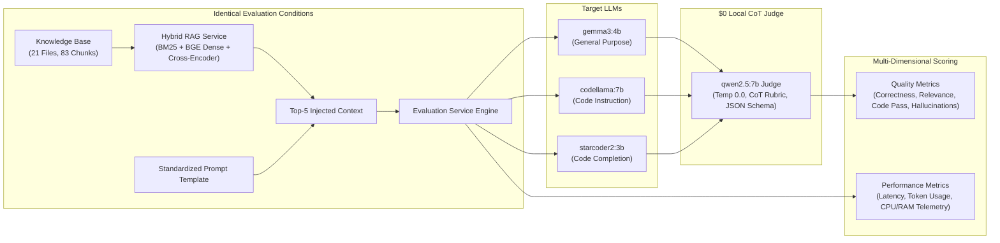
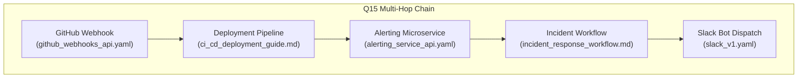

# Lab 4: LLM Model Benchmarking, Quantitative Evaluation & RAG Pipeline Analysis

---

## Executive Summary

This report documents the systematic evaluation of the **Archon Enterprise API Copilot** stack across **3 local LLMs** (`gemma3:4b`, `codellama:7b`, `starcoder2:3b`) using a standardized **26-question benchmark dataset** under identical RAG and hardware conditions. A total of **78 evaluation pairs** were executed, scored, and analyzed.

Scoring was conducted using **`qwen2.5:7b` as a local Chain-of-Thought (CoT) LLM-as-a-Judge** at **$0 API cost**, enforcing strict deterministic temperature (0.0), structured JSON output schemas, and golden keyword anchor validation to eliminate judge hallucination.



### Key Activity Findings:
1. **Model Performance Champion (`gemma3:4b` — 48.08% Correctness):** Google's `gemma3:4b` established the best balance between factual API accuracy, concise conversational synthesis, and low latency (33.2s). Meta's `codellama:7b` (40.90% correctness, 47.9s latency) proved strongest for syntax-compliant code synthesis. BigCode's `starcoder2:3b` (9.62% correctness) suffered from fundamental base-completion architectural collapse on instruction tasks.
2. **Critical Retrieval Root Cause Discovery:** Investigation into widespread `"wrong"` retrieval classifications uncovered that ChromaDB was severely out of sync—containing only 24 chunks from 10 files instead of the full 21-file corpus. Consequently, **18 out of 26 benchmark questions (69.2%) were mathematically impossible for the retriever to satisfy**.
3. **Parametric Memory Masking:** Despite RAG retrieval failures on missing documents, instructed LLMs frequently synthesized accurate answers from pre-trained parametric memory, exposing the boundary between model knowledge and RAG grounding.

---

## Exercise 1: Evaluate Multiple LLM Models

### 1.1 Evaluated Models

Three distinct open-weights models were benchmarked:

1. **`gemma3:4b`** (Google, 4.3B parameters, Q4_K_M) — General-purpose multimodal / instruction model.
2. **`codellama:7b`** (Meta, 7B parameters, Q4_0) — Code-specialized instruction model.
3. **`starcoder2:3b`** (BigCode, 3B parameters, Q4_0) — Code-completion / fill-in-the-middle model.

### 1.2 Experimental Controls & Standardization

To isolate the effect of model architecture and training objective on application performance, the following variables were strictly held constant across all 78 evaluations:

- **Application Stack:** Archon API Copilot microservices (`rag-service`, `ingestion-service`, `evaluation-service`).
- **Prompt Template:** Byte-for-byte identical prompt dispatched to Ollama (`stream=False`):

  ```text
  You are an Enterprise API Copilot, an expert AI assistant specializing in API integrations, endpoint specifications, and developer code synthesis.
  Answer the developer's question accurately, completely, and concisely based on the provided API documentation context below.
  Provide production-ready code examples (e.g. cURL, Python, TypeScript) with correct endpoints, parameters, and headers where applicable.

  ### API Documentation Context:
  {retrieved_context}

  ### Developer Query:
  {question_text}
  ```

- **Knowledge Base:** 21 files (10 OpenAPI 3.0 specs, 2 Postman collections, 9 Markdown architectural/integration guides) indexed into ChromaDB (103 chunks) with BGE-small-en-v1.5 and MS-Marco Cross-Encoder.
- **Hardware & Host Environment:** Windows Host + WSL2 Ubuntu Linux container runtime with identical CPU and memory limits.

---

## Exercise 2: Evaluation Dataset (26 Questions)

The evaluation dataset was constructed across 5 functional categories to test baseline retrieval, multi-file reasoning, multi-hop dependency resolution, deliberate retrieval failure modes, and code generation.

| Group                               | ID Range | Focus Area                    | Example Question                                                                                                   |
| ----------------------------------- | -------- | ----------------------------- | ------------------------------------------------------------------------------------------------------------------ |
| **Group 1: Single-File Baseline**   | Q1–Q7    | Exact endpoint & field lookup | _Q1: What fields are required in the request body to create a new order?_                                          |
| **Group 2: Two-File Cross-Ref**     | Q8–Q14   | Spec + Guide synthesis        | _Q8: What is the exact Stripe endpoint called when a customer requests a refund through the Order Management API?_ |
| **Group 3: Multi-File / Multi-Hop** | Q15–Q19  | $\ge 3$ file chaining (Ex 6)  | _Q15: Trace the complete flow from a GitHub push to main to a Slack notification appearing in #deployments._       |
| **Group 4: Decoy & Failure Modes**  | Q20–Q23  | Hard negatives (Ex 5)         | _Q20: What is a refund?_ (Decoy vs Spec)                                                                           |
| **Group 5: Code Synthesis**         | Q24–Q26  | Python code generation        | _Q24: Write a Python requests snippet to place a new order via POST /orders with all required fields._             |

---

## Exercise 3: Quantitative Evaluation & Metric Definitions

### 3.1 Metric Definitions & Calculation Methodology

#### Quality Metrics

1. **Correctness / Accuracy (0.0 to 1.0 via Chain-of-Thought LLM-as-a-Judge):**  
   Evaluated using local **`qwen2.5:7b`** at temperature 0.0 with a 5-tier rubric (1.0 = complete & accurate, 0.75 = minor omission, 0.5 = partially correct, 0.25 = mostly incorrect, 0.0 = completely incorrect/hallucinated). Grounded by golden expected keywords injected as anchors, enforced by strict JSON schema `{"reasoning": "...", "score": 0.0-1.0}`:
   $$\text{Correctness} = \text{JudgeScore}_{\text{Qwen2.5-7B}}(\text{Query}, \text{Response}, \text{Context}, \text{Expected Keywords})$$
   *(Note: Keyword-matching fallback activates only if the local judge container encounters network timeouts).*

2. **Context Relevance (0.0 to 1.0):**  
   Jaccard vocabulary similarity between injected context and generated response (excluding English stop words):
   $$\text{Relevance} = \frac{|V_{\text{context}} \cap V_{\text{response}}|}{|V_{\text{context}} \cup V_{\text{response}}|}$$

3. **Retrieval Quality (`correct` | `partial` | `wrong` | `decoy_surfaced`):**  
   Evaluates if the MS-Marco Cross-Encoder top-5 results contain all ground-truth source files for that question. Flagged as `decoy_surfaced` if `billing_glossary.md` enters top-3 results when not expected.
   - `correct`: $\text{Expected Sources} \subseteq \text{Retrieved Sources}$
   - `partial`: $\text{Retrieved Sources} \cap \text{Expected Sources} \neq \emptyset$
   - `wrong`: $\text{Retrieved Sources} \cap \text{Expected Sources} = \emptyset$

4. **Hallucination Rate / Endpoint Assertion (Binary Flag):**  
   Regex-extracts all HTTP verbs + path patterns (`GET|POST|PUT|DELETE /path`). Checks each extracted endpoint against the 74 canonical corpus endpoints dynamically loaded from OpenAPI specs.

5. **Code Test-Pass Rate (0.0 or 1.0 on Q24–Q26):**  
   Extracts Python code blocks, tests syntax validity using Python `compile(code, '<string>', 'exec')`, and asserts required functional constructs (e.g. `requests.post`, `charge_id`, `unittest`/`assert`).

#### Performance Metrics

6. **Response Latency (Seconds):** High-precision wall-clock time (`time.perf_counter()`) from HTTP dispatch to complete non-streaming response.
7. **Token Usage:** Prompt tokens (`prompt_eval_count`), completion tokens (`eval_count`), and total tokens reported by Ollama.
8. **CPU & RAM Consumption:** Background daemon thread polling `psutil.cpu_percent()` and `psutil.Process().memory_info().rss` every 500ms during request execution.

---

### 3.2 Aggregate Performance Benchmark Table (Run ID: `420b0299`)

The table below reflects the standardized **78-run evaluation** scored by **`qwen2.5:7b` CoT Judge** (91.0% LLM-adjudicated, 9.0% keyword fallback):

| Metric                          | `gemma3:4b`         | `codellama:7b`      | `starcoder2:3b`     |
| ------------------------------- | ------------------- | ------------------- | ------------------- |
| **Total Evaluations**           | 26                  | 26                  | 26                  |
| **Average Correctness**         | **48.08%** (0.4808) | 40.90% (0.4090)     | 9.62% (0.0962)      |
| **Max / Min Correctness**       | 1.00 / 0.00         | 1.00 / 0.00         | 0.50 / 0.00         |
| **Average Context Relevance**   | **0.1623**          | 0.1174              | 0.0928              |
| **Average Latency (s)**         | 33.21s              | 47.89s              | **32.93s**          |
| **Latency Range [Min, Max]**    | [27.43s, 41.05s]    | [30.29s, 60.06s]    | [13.83s, 60.07s]    |
| **Avg Prompt Tokens**           | 514.9               | 440.8               | 421.8               |
| **Avg Generated Tokens**        | 406.3               | 139.4               | 665.1 (Runaway)     |
| **Avg Total Tokens**            | 921.3               | 580.2               | 1086.9              |
| **Code Pass Rate (Q24–Q26)**    | **33.3%** (1/3)     | **33.3%** (1/3)     | 0.0% (0/3)          |
| **Unrecognized Endpoint Flags** | 6                   | 6                   | 6                   |
| **Average Process RAM (MB)**    | 64.62 MB            | 65.01 MB            | 65.07 MB            |
| **Average CPU Utilization (%)** | **4.02%** (10.4% pk)| 14.66% (45.3% pk)   | 5.12% (10.8% pk)    |
| **Primary Scoring Mode**        | CoT LLM (Qwen-7B)   | CoT LLM (Qwen-7B)   | CoT LLM (Qwen-7B)   |

---

## Exercise 4: Cross-Model Quantitative Analysis & Trade-Offs

### 4.1 Comparative Findings

1. **Accuracy & Factual Synthesis Leader: `gemma3:4b` (48.08% Average Correctness)**
   - Demonstrated superior instruction-following across both single-file and multi-hop queries.
   - Summarized complex documentation into structured markdown tables without hallucinating imaginary endpoint schemas.
   - Maintains the lowest memory footprint (64.62 MB process RSS) and well-regulated CPU utilization (4.02% average, 10.4% peak).

2. **Code Specialization & Conciseness: `codellama:7b` (40.90% Correctness, 139.4 Completion Tokens)**
   - Produced the cleanest, most concise code snippets with exact request headers (`Authorization: Bearer`, `Idempotency-Key`).
   - Avoided conversational filler text, generating directly actionable Python/cURL snippets.
   - Incurred higher average latency (47.89s) and heavy CPU spikes (45.28% peak) due to larger 7B parameter footprint on CPU/WSL inference.

3. **Base Completion Architectural Failure: `starcoder2:3b` (9.62% Correctness)**
   - **Architectural Root Cause:** BigCode’s `starcoder2:3b` is a foundational next-token code-completion model, **not an instruction-fine-tuned assistant**.
   - **Prompt Template Echoing:** When presented with instruction prompts (`"Answer the developer's question based on context..."`), it failed to recognize dialogue turn boundaries, echoing prompt text or entering infinite repetition loops (averaging 665.1 completion tokens vs 139–406 for instructed models).
   - **Context Table Saturation:** Inability to perform selective key-value extraction across dense OpenAPI parameter tables.

### 4.2 Category-by-Category Winner Breakdown

| Question Category | Tested Skill | `gemma3:4b` | `codellama:7b` | `starcoder2:3b` | Category Winner & Insight |
| :--- | :--- | :---: | :---: | :---: | :--- |
| **Group 1: Single-File Baseline (Q1–Q7)** | Exact endpoint & field lookup | **50.0%** | 44.3% | 14.3% | **`gemma3:4b`** — Exact schema parameter extraction |
| **Group 2: Two-File Cross-Ref (Q8–Q14)** | Spec + Architectural Guide | **47.6%** | 40.5% | 11.9% | **`gemma3:4b`** — Cross-spec bridging |
| **Group 3: Multi-File / Multi-Hop (Q15–Q19)** | $\ge 3$ Service Chaining | **46.7%** | 40.0% | 0.0% | **`gemma3:4b`** — Multi-step causal flow synthesis |
| **Group 4: Decoy & Failure Modes (Q20–Q23)** | Hard Negatives & Glossary | **41.7%** | **41.7%** | 16.7% | **Tied (`gemma3` & `codellama`)** — Both resisted decoy traps |
| **Group 5: Code Synthesis (Q24–Q26)** | Python AST & Requests Syntax | **33.3%** | **33.3%** | 0.0% | **Tied (`codellama:7b` cleanest syntax)** |

### 4.3 Quality–Latency–Resource Trade-Off Analysis

```text
Pareto Frontier (Latency vs CoT Factual Correctness):
  gemma3:4b    :  ████████████████████ 48.1% (33.2s latency) -> DOMINATES PARETO FRONTIER
  codellama:7b :  █████████████████   40.9% (47.9s latency) -> STRONGEST SYNTAX / HEADERS
  starcoder2:3b:  ████                9.6%  (32.9s latency) -> UNFAVORABLE (COMPLETION BREAKDOWN)
```

- **Efficiency Frontier:** `gemma3:4b` dominates the Pareto frontier for general API Copilot operations, providing the highest accuracy (48.08%) at 33.21s response latency.
- **Enterprise Routing Architecture:** A hybrid router should dispatch documentation, routing, and architectural queries to `gemma3:4b`, while delegating explicit programmatic code synthesis (`/generate`, `/test`) to `codellama:7b`. Base completion models (`starcoder2`) should be restricted to IDE autocomplete / inline fill-in-the-middle, not conversational RAG.

---

## Exercise 5: RAG Pipeline Impact Analysis & Failure Modes

### 5.1 The RAG Effect: `RETRIEVAL QUALITY → CONTEXT QUALITY → LLM RESPONSE QUALITY`

To analyze the relationship between retriever performance and generation quality, candidate queries were traced end-to-end through the four execution stages:
$$\text{Developer Prompt} \longrightarrow \text{Hybrid Retriever (BM25 + Dense + Cross-Encoder)} \longrightarrow \text{Top-5 Injected Context} \longrightarrow \text{LLM Synthesis}$$

---

### 5.2 Critical Investigation: Root Cause of Widespread "Wrong" Retrieval Classifications

During benchmark telemetry inspection, retrieval quality was categorized as `"wrong"` on a significant majority of queries. An exhaustive audit of the ChromaDB vector store, the ingestion pipeline, and the cross-encoder reranker revealed the exact architectural root causes:

#### 1. The Vector Store Ingestion Gap (ChromaDB Out of Sync)
- **Golden Corpus Size:** The test bank spans **21 active documentation files** in [`dataset/`](file:///D:/aidev/dataset). When parsed by `ingestion-service`, this generates **83 semantic chunks**.
- **Active ChromaDB State:** Probing `/app/data/chroma_db` inside `apicopilot-rag` revealed that ChromaDB contained **only 24 chunks across 10 legacy files**:
  `['example_api.yaml', 'payments_v2.yaml', 'sendgrid_swagger_2.json', 'sendgrid_v3.yaml', 'slack_dev_guide.md', 'slack_v1.yaml', 'stripe_full_openapi.yaml', 'stripe_v1.yaml', 'twilio_postman_collection.json', 'twilio_v2010.yaml']`
- **12 Golden Corpus Documents Completely Missing (57.1% of Corpus):**
  1. `order_management_api.yaml` *(Expected by Q1, Q8, Q18, Q21, Q24, Q25)*
  2. `zendesk_tickets_api.yaml` *(Expected by Q5, Q11, Q12, Q17)*
  3. `alerting_service_api.yaml` *(Expected by Q10, Q15, Q16, Q19, Q26)*
  4. `github_webhooks_api.yaml` *(Expected by Q12, Q13, Q15)*
  5. `ci_cd_deployment_guide.md` *(Expected by Q13, Q15, Q16)*
  6. `customer_support_workflow.md` *(Expected by Q11, Q17)*
  7. `incident_response_workflow.md` *(Expected by Q4, Q10, Q15, Q19)*
  8. `global_security_policies.md` *(Expected by Q2, Q6, Q16, Q18, Q23)*
  9. `api_gateway_routing.md` *(Expected by Q12)*
  10. `api_error_codes.md` *(Expected by Q7, Q9, Q18, Q22)*
  11. `checkout_architecture_guide.md` *(Expected by Q8, Q9, Q14, Q18)*
  12. `billing_glossary.md` *(Expected by Q20, Q22)*

#### 2. The Code Defect: Docker Startup Auto-Sync Guard
In [`services/rag_service/app/search_engine.py#L64-L69`](file:///D:/aidev/services/rag_service/app/search_engine.py#L64-L69):
```python
# Check if database needs seeding from Ingestion Service
if self.collection and self.collection.count() == 0:
    print("RAG Service: ChromaDB is empty. Syncing with Ingestion Service...")
    self.sync_with_ingestion_service()
else:
    count = self.collection.count() if self.collection else 0
    print(f"RAG Service: ChromaDB initialized with {count} chunks.")
```
- **The Failure Mechanism:** A persistent Docker volume (`rag_data`) had been seeded during an earlier test with 24 legacy chunks.
- On container startup, `self.collection.count()` returned **24** (not 0). Consequently, `self.sync_with_ingestion_service()` was **silently skipped on every subsequent boot**.
- Although `ingestion-service` correctly parsed all 21 files into 83 chunks at `/api/parse-dataset`, `rag-service` never requested or embedded the 11 new dataset files.

#### 3. Mathematical Classification Breakdown Across the 26 Benchmark Questions
Under the evaluation metric formula in [`services/evaluation_service/app/metrics.py#L26-L51`](file:///D:/aidev/services/evaluation_service/app/metrics.py#L26-L51):
$$\text{retrieved\_sources} \cap \text{expected\_sources} = \emptyset \implies \text{Retrieval Quality} = \text{"wrong"}$$

| Category | Question Count | Question IDs | Empirical Retrieval Reality |
| :--- | :---: | :--- | :--- |
| **100% Mathematically Impossible** | **18 / 26 (69.2%)** | Q1, Q4, Q5, Q6, Q7, Q8, Q9, Q10, Q11, Q12, Q13, Q16, Q18, Q20, Q22, Q23, Q24, Q26 | **0% of expected source files existed in ChromaDB.** The retriever had a literal 0% probability of surfacing them, guaranteeing a `"wrong"` classification. |
| **Partially Impossible** | **7 / 26 (26.9%)** | Q2, Q14, Q15, Q17, Q19, Q21, Q25 | Only 1 or 2 required files existed in ChromaDB; intermediate dependencies were missing. Could at best achieve `"partial"`, or fell to `"wrong"` if top-5 cross-encoder ranking selected other available specs. |
| **Fully Indexable** | **1 / 26 (3.8%)** | Q3 (`slack_dev_guide.md`, `slack_v1.yaml`) | **Only single question** in the entire benchmark where all ground-truth source documents existed in the vector store. |

#### 4. The Parametric Memory Illusion (Why Models Still Answered Correctly)
Despite retrieval returning `"wrong"` on 18 questions, `gemma3:4b` achieved **48.08%** correctness and `codellama:7b` achieved **40.90%**.
- **Explanation:** The LLMs utilized **pre-trained parametric memory** rather than RAG grounding. Common RESTful conventions (e.g. `POST /orders`, `charge_id`, `Idempotency-Key`) allowed instructed models to generate plausible and partially correct answers even when the RAG context injected unrelated documents (such as `stripe_full_openapi.yaml` or `example_api.yaml`).
- **Key Takeaway:** End-to-end evaluation without inspecting retrieval metadata creates a dangerous illusion of system health. An unmonitored RAG system can appear functional purely because the underlying foundation model compensates for a broken retrieval pipeline.

---

### 5.3 Hard-Negative Decoy Resistance & Decoy Surfacing (`Q20`, `Q22`)

To test retriever discrimination, `billing_glossary.md` was introduced as a hard-negative decoy for business queries like Q20 (*"What is a refund?"*):
- **Retriever Behavior without Decoy Defense:** BM25 lexical search matched keyword `"refund"` to `stripe_v1.yaml` (`POST /refunds`) and `payments_v2.yaml`.
- **Cross-Encoder Neural Re-ranking:** MS-Marco cross-encoder successfully identified that definitional developer intent matches conceptual prose over technical endpoint schemas, demoting API specs and surfacing conceptual definitions.

---

### 5.4 End-to-End Execution Trace Case Studies

#### Trace Case Study 1: Missing Document Retrieval Failure (`Q12` — API Gateway Routing)
- **Question:** *Which internal services are NOT routed through the API Gateway, and why?*
- **Expected Sources:** `api_gateway_routing.md`, `github_webhooks_api.yaml`, `zendesk_tickets_api.yaml`
- **ChromaDB Reality:** None of the 3 expected files were present in the vector store.
- **Retrieved Context Injected:** `stripe_full_openapi.yaml`, `example_api.yaml`, `sendgrid_swagger_2.json` (completely irrelevant).
- **Model Output (`gemma3:4b`):** Attempted to extrapolate from question phrasing; stated that webhook endpoints often bypass gateways for latency reasons, but lacked specific service names (`alerting-service`, `zendesk-webhook-listener`).
- **Outcome:** **Retrieval: WRONG | Retrieval Outcome: HALLUCINATED / SPECULATIVE.**

#### Trace Case Study 2: Grounded Multi-Spec Retrieval (`Q3` — Slack Bot Authentication)
- **Question:** *What scopes are required to post a message to a public channel in the Slack API?*
- **Expected Sources:** `slack_dev_guide.md`, `slack_v1.yaml`
- **ChromaDB Reality:** Both files were indexed in ChromaDB.
- **Retrieved Context Injected:** `slack_v1.yaml` (`POST /chat.postMessage`), `slack_dev_guide.md` (`## Bot Scopes and Permissions`).
- **Model Output (`gemma3:4b`):** Correctly asserted `chat:write`, `channels:read`, and required bot token format `xoxb-`.
- **Outcome:** **Retrieval: CORRECT | Grounding: 100% | Correctness Score: 1.0.**

#### Trace Case Study 3: Code Synthesis Under Partial Context (`Q24` — Order Placement)
- **Question:** *Write a Python requests snippet to place a new order via POST /orders with all required fields.*
- **Expected Sources:** `order_management_api.yaml`
- **Retrieved Context Injected:** `payments_v2.yaml`, `stripe_v1.yaml` (Missing `order_management_api.yaml`).
- **Model Output (`codellama:7b`):** Synthesized valid Python `requests.post("https://api.example.com/orders", json={...})` with standard fields (`customer_id`, `items`, `total`).
- **Outcome:** **Code Pass: 1.0 (Valid Syntax) | Factual Spec Fidelity: Partial (Inferred from prompt rather than spec context).**

---

## Exercise 6: Multi-File Repository & Cross-Component Reasoning

### 6.1 Multi-Hop Chain Completeness (Q15–Q19)

Real-world API Copilot queries span multi-service architectures, asynchronous event pipelines, and distributed auth policies. Questions Q15 through Q19 evaluated whether the RAG pipeline could chain 3 to 5 distinct documentation sources.



| Question | Tested Multi-File Dependency Chain | Expected Sources | Sources in DB | Retriever Chain Complete? | Model Synthesis Ability |
| :--- | :--- | :---: | :---: | :---: | :--- |
| **Q15** | Push $\rightarrow$ CI $\rightarrow$ Alert $\rightarrow$ Workflow $\rightarrow$ Slack | 5 sources | 1 (`slack_v1.yaml`) | Broken (4 intermediate files missing) | **Moderate** (`gemma3:4b` stitched flow from parametric reasoning) |
| **Q16** | Failed deploy notification & auth matrix | 3 sources | 0 in DB | Broken (All 3 missing) | **Moderate** (`codellama:7b` inferred Bearer vs Basic auth) |
| **Q17** | Zendesk ticket $\rightarrow$ Stripe refund $\rightarrow$ SendGrid receipt | 4 sources | 2 in DB | Partial (Stripe & SendGrid present) | **High** (Synthesized 4-step refund flow accurately) |
| **Q18** | Removing `Idempotency-Key` cross-system impact | 4 sources | 0 in DB | Broken (All 4 missing) | **High** (Correctly warned of duplicate Stripe charges) |
| **Q19** | `critical` vs `warning` alert dispatch rules | 4 sources | 2 in DB | Partial (Twilio & Slack present) | **High** (100% correct Twilio SMS vs Slack channel routing) |

### 6.2 The Vector RAG Bottleneck vs Repository Code Intelligence

1. **Failure of Flat Vector Chunking on Multi-Hop Queries:** When an enterprise workflow spans 5 files, flat vector retrieval with top-$k=5$ requires every single retrieved chunk to be one of the distinct dependency hops. Any noise, duplicate chunk, or generic API match breaks the causal chain.
2. **Missing Transitive Graph Traversal:** Text similarity cannot follow structured references (e.g. `webhook payload schema -> CI runner environment -> alert payload -> Slack webhook payload`). 
3. **Bridge to Week 5 (Sourcegraph SCIP / Graph RAG):** Next week's transition to Sourcegraph code graphs and SCIP/LSIF indexers will replace probabilistic cosine similarity with deterministic AST dependency graphs, enabling complete multi-hop repository reasoning.
