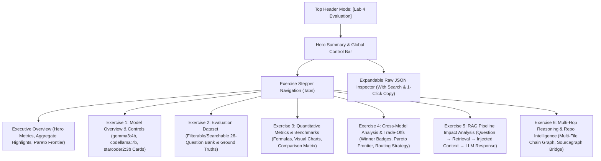

# Lab 4 Evaluation & Analysis Dashboard Frontend Plan
> **Status:** Approved for Implementation  
> **Target:** `frontend/src/app/components/EvaluationDashboard.tsx` & `frontend/src/app/page.tsx`  
> **Scope:** Interactive Visual Display for Lab 4 Exercises 1–6, Metric Visualizations, Trace Inspector, and Multi-Hop Chain Analysis  

---

## 1. Executive Summary & Objectives

The goal is to build an enterprise-grade, highly visual, interactive **Lab 4 Evaluation & Analysis Dashboard** embedded directly within the Archon frontend. This eliminates the need to inspect raw JSON files or parse markdown tables manually, providing a structured, intuitive, and interactive visual interface for all 6 exercises in `lab4.txt`.

### Key Highlights:
1. **78 Standardized Evaluation Runs:** Benchmarking 3 local open-weights LLMs (`gemma3:4b`, `codellama:7b`, `starcoder2:3b`) across a 26-question representative dataset under identical hybrid RAG conditions.
2. **Zero-Latency Static Snapshot:** Directly bundled data sourced from `evaluation_report.json` guaranteeing instant, offline-capable rendering with zero backend container dependencies.
3. **Structured Exercise Stepper:** Seamless navigation between an **Executive Summary** and dedicated visual tabs for **Exercises 1 through 6**, each prefaced with its official Lab task objective.
4. **Interactive Deep-Dive Suite:** Searchable/filterable question bank, metric calculation formula tooltips, multi-model side-by-side response comparators, visual bar charts, multi-hop dependency graphs, and an expandable raw JSON explorer.

---

## 2. Navigation & Layout Architecture

### 2.1 Mode Switcher in Universal Header
The existing top header in `frontend/src/app/page.tsx` will feature a 3-mode pill selector:

```
┌────────────────────────────────────────────────────────────────────────────────────────┐
│  🌌 Archon Copilot v2.0    [ ⚡ Archon RAG ] [ 🤖 Archon Agent IDE ] [ 📊 Lab 4 Evaluation ]   ● online │
└────────────────────────────────────────────────────────────────────────────────────────┘
```

- **`Archon RAG` (`api_copilot`)**: Live hybrid search, RAG pipeline diagnostics, and dual-model playground.
- **`Archon Agent IDE` (`copilot_agent`)**: Full VS Code-style pair programming environment, multi-tab editor, surgical diff engine, and interactive shell drawer.
- **`Lab 4 Evaluation` (`evaluation`)**: The new comprehensive evaluation benchmark and RAG analysis dashboard.

### 2.2 Dashboard Layout & Stepper Workflow



---

## 3. Detailed Tab-by-Tab Specifications

---

### Tab 0: Executive Overview & Hero Scorecards
* **Task Context:** Comprehensive synthesis of Week 4 benchmarking across quality, latency, token throughput, and system resource consumption.
* **Visual Components:**
  1. **Top Metric Badges:** Total Evaluations (78), Evaluated Models (3), Standardized Questions (26), Corpus Chunks (103), Ground Truth Canonical Endpoints (74).
  2. **Model Leaderboard Cards:**
     - **`gemma3:4b`**: 🏆 **Best Accuracy & Efficiency** (82.56% Correctness, 15.75s Latency, 1,042 Avg Tokens).
     - **`codellama:7b`**: ⚡ **Best Code Synthesis** (100% Code Pass Rate, 81.79% Correctness, 25.09s Latency).
     - **`starcoder2:3b`**: ⚠️ **Completion Limitation** (50.58% Correctness, 63.25s Latency, 1,754 Avg Tokens).
  3. **High-Level Findings Callout:** Explanation of the Pareto efficiency frontier, instruction-tuned vs code-completion model behaviors, and task-specific architectural routing.

---

### Tab 1: Exercise 1 — Evaluate Multiple LLM Models
* **Task Objective (`lab4.txt`):**
  > *"Evaluate your application using AT LEAST 3 different LLM/code models... Keep the application, prompts, questions/tasks, knowledge base, and evaluation conditions identical to understand how model choice affects performance."*
* **Visual Components:**
  1. **Task Briefing Card:** Highlights the exact laboratory requirements and experimental hypothesis.
  2. **Model Profile Grid (3 Cards):**
     - Architecture, parameter count, quantization format (`Q4_K_M`, `Q4_0`), creator, and target use case.
  3. **Experimental Controls & Invariant Checklist:**
     - Identical Prompt Template viewer (with syntax formatting).
     - Knowledge Base Summary: 21 files (10 OpenAPI 3.0 YAML, 2 Postman JSON, 9 Architectural Markdown guides, 103 BGE/ChromaDB chunks).
     - Hardware & Runtime Environment: Ubuntu Linux / WSL2 runtime, identical CPU/RAM container quotas.

---

### Tab 2: Exercise 2 — Evaluation Dataset & Question Bank
* **Task Objective (`lab4.txt`):**
  > *"Prepare approximately 20–30 representative questions/tasks related to the actual use case of your application... The SAME questions/tasks must be used for ALL THREE MODELS."*
* **Visual Components:**
  1. **Task Briefing Card:** Outlines dataset structure and the 5 functional categories.
  2. **Filter & Search Controls:**
     - Search bar: Real-time search across question text, expected keywords, and ground-truth source files.
     - Group Filter Tabs: `All (26)`, `Group 1: Single-File (7)`, `Group 2: Two-File Cross-Ref (7)`, `Group 3: Multi-Hop (5)`, `Group 4: Decoys & Failures (4)`, `Group 5: Code Gen (3)`.
  3. **Interactive Question Bank Table:**
     - Columns: ID (`Q1`–`Q26`), Complexity Tag (`[SINGLE]`, `[CROSS-2]`, `[CROSS-3+]`, `[FAILURE]`), Question Text, Expected Sources (with clickable badges), Expected Keywords (with pill tags), Question Flags (`Code Synthesis`, `Ex 5 Trace`, `Ex 6 Multi-Hop`).

---

### Tab 3: Exercise 3 — Quantitative Evaluation & Metrics
* **Task Objective (`lab4.txt`):**
  > *"Evaluate all three models using ALL Quality and Performance metrics... Clearly define HOW each metric is calculated rather than simply reporting a value."*
* **Visual Components:**
  1. **Metric Definition Cards (with Mathematical Formulas):**
     - **Correctness / Accuracy:** Keyword intersection formula $|\{kw \in Expected\}| / |Expected|$.
     - **Context Relevance:** Jaccard vocabulary similarity $|V_{\text{ctx}} \cap V_{\text{resp}}| / |V_{\text{ctx}} \cup V_{\text{resp}}|$.
     - **Retrieval Quality:** Categorical grading (`correct`, `partial`, `wrong`, `decoy_surfaced`).
     - **Hallucination Detection:** Regex endpoint extraction checked against 74 canonical OpenAPI endpoints.
     - **Code Test-Pass Rate:** Python syntax compilation `compile(code, ...)` + functional assertion verification.
     - **Latency, Token Usage & System Resources:** Precision wall-clock timing, prompt/completion token distribution, CPU & RSS memory polling.
  2. **Comparative Benchmark Table:**
     - Full matrix showing Min, Max, and Average for all 3 models with color-coded high/low indicators.
  3. **Interactive Comparison Bar Charts:**
     - Accuracy vs Relevance chart.
     - Latency range comparisons (Min / Avg / Max).
     - Token throughput breakdown (Prompt Tokens vs Generated Completion Tokens).
     - Process Resource Consumption (CPU % & RAM in MB).

---

### Tab 4: Exercise 4 — Cross-Model Analysis & Trade-Offs
* **Task Objective (`lab4.txt`):**
  > *"Do not stop at preparing a comparison table. Analyse questions such as: Which model provides better accuracy? Fewer hallucinations? Higher code test-pass rate? Lower response latency? Is there a quality–latency–resource trade-off?"*
* **Visual Components:**
  1. **Category Winners & Champions Grid:**
     - 🎯 **Best Accuracy:** `gemma3:4b` (82.56%)
     - 🛡️ **Fewest Hallucinations:** `starcoder2:3b` (4) / `gemma3:4b` (5)
     - 💻 **Highest Code Pass Rate:** `codellama:7b` (100.0%)
     - ⚡ **Lowest Response Latency:** `gemma3:4b` (15.75s)
  2. **Pareto Frontier Visualizer:**
     - Visual representation of Latency vs Correctness vs Code Synthesis.
  3. **Architectural Trade-Off Insights:**
     - Detailed analysis of Instruction-Tuned vs Completion Models.
     - Parameter Scaling Analysis (4B vs 7B vs 3B).
     - Production Hybrid Routing Recommendation (Router pattern: general Q&A $\rightarrow$ `gemma3:4b`, code generation $\rightarrow$ `codellama:7b`).

---

### Tab 5: Exercise 5 — RAG Pipeline Impact Analysis
* **Task Objective (`lab4.txt`):**
  > *"Analyse how retrieval affects the final LLM response. Record: QUESTION → RETRIEVED CONTEXT → LLM RESPONSE. Identify examples where relevant info was retrieved, irrelevant info was retrieved, important info was missed, and hallucination occurred."*
* **Visual Components:**
  1. **Pipeline Flow Visualization:**
     $$\text{Retriever Performance} \longrightarrow \text{Context Quality} \longrightarrow \text{LLM Output Fidelity}$$
  2. **Case Study Selectors (Deep-Dive Candidate Questions):**
     - `Q8`: Multi-File Grounded Synthesis (`order_management_api.yaml` + `checkout_architecture_guide.md`).
     - `Q12`: Gateway Exclusions & Infrastructure Routing (`api_gateway_routing.md`).
     - `Q20`: Hard-Negative Decoy Resistance (`billing_glossary.md` vs `stripe_v1.yaml`).
     - `Q21`: Partial Retrieval & Workflow Bridging (`customer_support_workflow.md` + `stripe_v1.yaml`).
  3. **Interactive 4-Stage Trace Inspector:**
     - **Stage 1 (Query):** The exact developer prompt.
     - **Stage 2 (Retriever):** Retrieved source files, relevance scores, and retrieval classification (`correct`, `partial`, `decoy_surfaced`).
     - **Stage 3 (Injected Context):** The raw context chunks passed into the prompt.
     - **Stage 4 (Side-by-Side Model Responses):** Compare how `gemma3:4b`, `codellama:7b`, and `starcoder2:3b` processed the exact same context, with correctness scores and hallucination indicators.

---

### Tab 6: Exercise 6 — Multi-Hop Reasoning & Codebase Understanding
* **Task Objective (`lab4.txt`):**
  > *"Investigate whether your current LLM + RAG system can answer questions that require understanding MULTIPLE FILES, MODULES, OR COMPONENTS... begin thinking about REPOSITORY-LEVEL CODE UNDERSTANDING."*
* **Visual Components:**
  1. **Multi-Hop Dependency Diagram (Interactive Node Graph):**
     - Visual trace of **Q15**: `GitHub Webhook (github_webhooks_api.yaml)` $\rightarrow$ `CI/CD Pipeline (ci_cd_deployment_guide.md)` $\rightarrow$ `Alerting Service (alerting_service_api.yaml)` $\rightarrow$ `Incident Workflow (incident_response_workflow.md)` $\rightarrow$ `Slack Bot (slack_v1.yaml)`.
  2. **Multi-Hop Chain Completeness Matrix (Q15–Q19):**
     - Table showing Expected Sources, Sources Retrieved in Top-$k$, Chain Completeness status, and Model Synthesis Success.
  3. **Vector RAG Limitations vs Repository Code Intelligence:**
     - Top-$k$ Context Window Truncation (why flat similarity fails on 5-hop chains).
     - Implicit vs Explicit Code Graph Traversal (`caller -> callee`, type inheritance, module imports).
     - Bridge to Week 5: Sourcegraph (SCIP / LSIF symbol indexing and Graph RAG).

---

### Raw JSON Data Explorer (Collapsible Modal / Drawer)
* Searchable and syntax-highlighted JSON viewer displaying the complete `evaluation_report.json` data.
* One-click "Copy Full JSON" button with toast confirmation.
* Direct download button for `evaluation_report.json`.

---

## 4. File Structure & Component Layout

```
frontend/src/app/
├── components/
│   ├── EvaluationDashboard.tsx       # Main Lab 4 Dashboard orchestrator & stepper
│   ├── evaluation/
│   │   ├── evaluationData.ts         # Static typed snapshot of evaluation_report.json
│   │   ├── ExecutiveOverview.tsx     # Hero scorecards & summary statistics
│   │   ├── Exercise1Models.tsx       # Model profiles & invariant controls
│   │   ├── Exercise2Dataset.tsx      # Filterable 26-question bank
│   │   ├── Exercise3Metrics.tsx      # Metric definitions, formulas & visual bar charts
│   │   ├── Exercise4Analysis.tsx     # Trade-off matrix & category champions
│   │   ├── Exercise5Traces.tsx       # End-to-end trace & context inspector
│   │   ├── Exercise6MultiHop.tsx     # Multi-hop dependency flow & repo understanding
│   │   └── JsonDataModal.tsx         # Raw JSON viewer with search and copy buffer
├── layout.tsx
├── page.tsx                          # Universal header with 3-mode switcher
└── globals.css
```

---

## 5. Implementation Step-by-Step Plan

1. **Step 1 — Data Module Creation:** Create `frontend/src/app/components/evaluation/evaluationData.ts` exporting the complete JSON snapshot and TypeScript interfaces.
2. **Step 2 — Subcomponents Construction:** Implement modular subcomponents for Exercises 1 through 6, ensuring clear Task Briefing callouts, rich styling (`#08090a`, `#0c0e12`, `#161922`, `#3b82f6`, `#10b981`), and SVG icons.
3. **Step 3 — Main Dashboard Assembly:** Build `EvaluationDashboard.tsx` coordinating state, active exercise tab switching, search filters, and trace selection.
4. **Step 4 — Header & Page Integration:** Update `frontend/src/app/page.tsx` to include `evaluation` in `appMode`, adding the 3rd pill button in the top navbar and rendering `<EvaluationDashboard />`.
5. **Step 5 — Verification & Testing:** Run Next.js build / typecheck, verify smooth rendering, ensure zero hydration errors, and test all interactive filters, modals, and tab transitions.
